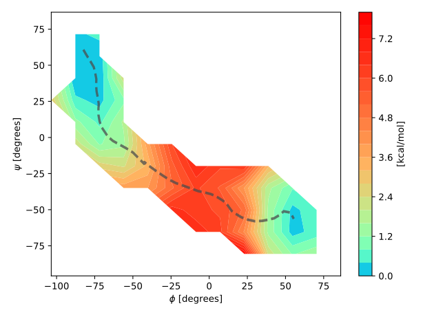

String method for alanine dipeptide with it's phi-psi angles

# Running the example
There are two bash scripts, **run_steered.sh** and **run_string.sh**, for running it on a single machine. 
You need to run steered MD before string MD. 
The number of beads and initial string to be generated in the steering simulation is determined by the string0.txt file. You can choose between a short, intermediate (default), long string or make your own.
There's also a script **submit_beskow.sh** for running it in a slurm environment with MPI.

# Postprocessing
You find two python scripts for visualization and postprocessing: one for visualizing the strings and convergence,
and one for computing the free energy from the transitions.
The latter also provides an optional method which handles the periodicity issue with dihedral angles by converting the dihadral angles to principal components with dihedral-PCA.

Note that these scripts require you to have matplotlib and scikit-learn installed.

# Learnings
This example is useful to familiarize yourself with the method. Below are some learnings you can make:

 * Hopefully, you'll find that the string converges on average, but that it fluctuates around an equilibrium position even after many simulations. 
 Increasing the swarm size does not fix the issue; it's due to orthogonal degrees of freedom in your system. An interesting excercise is to see what happens if you include the other dihedral angles for alanine dipeptide as CVs too. 
 * Convergence of the free energy surface happens in about 150 iterations, although string convergence (oscilation about the equilibrium position) occurs before. 
 * The number of grid-points with which the FES is generated can be decreased to make the free energy surface less noisy or increased to increase detail. 
 * The current number of points on the string and swarm length match eachother decently, but note that this requires some manual fine tuning. 
 You can try to run the simulation with a longer or short string and see what happens. 
 If you have many points and long swarms, you might end up with loops on the string. If the points are too few and the swarms too short, you won't have transitions between points and not get a converged free energy landscape. 
 The shorter the swarms, the more detailed landscape you'll obtain, but you risk getting stuck in local minimas. 
 * ...